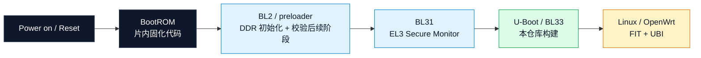
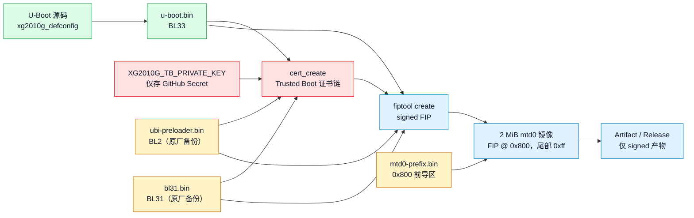
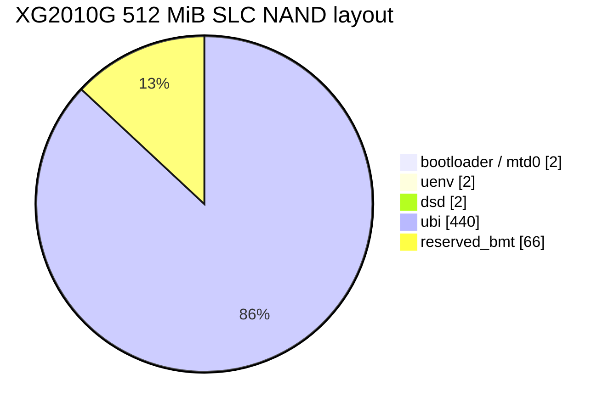
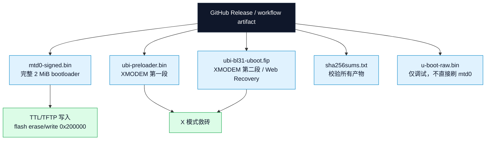
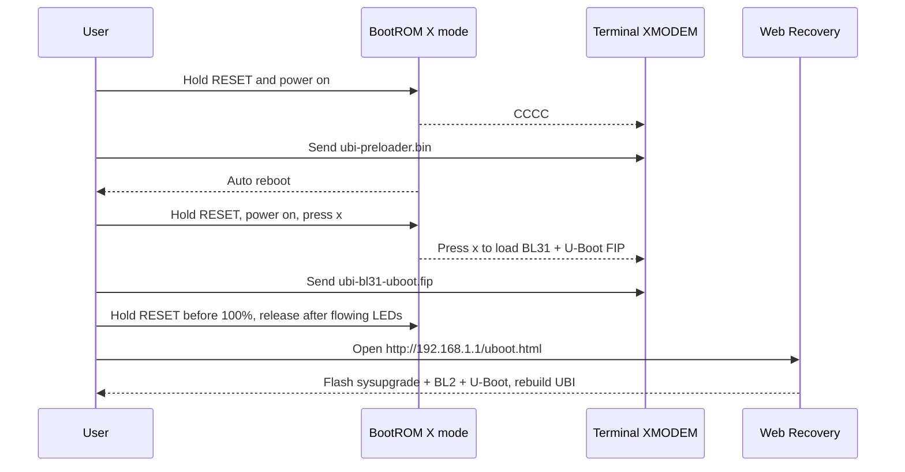

<!-- SPDX-License-Identifier: GPL-2.0+ -->

<a id="top"></a>

<h1 align="center">Brightspeed XG2010G U-Boot Bootloader</h1>

<p align="center">
  <strong>用于替换 Brightspeed XG2010G 原厂 <code>/dev/mtd0</code> 的 signed U-Boot/FIP 启动镜像。</strong><br>
  <sub>本仓库为社区非官方固件· 刷写有变砖风险，请先完整备份</sub>
</p>

<p align="center">
  
  
  
</p>

<p align="center">
  <a href="https://github.com/naoki66/u-boot-xg2010g/releases">
    
  </a>
  <a href="https://github.com/naoki66/u-boot-xg2010g/actions/workflows/build-mtd0.yml">
    
  </a>
  <a href="doc/board/airoha/xg2010g.rst">
    
  </a>
  <a href="board/airoha/xg2010g/firmware/README.md">
    
  </a>
</p>

<p align="center">
  <a href="https://github.com/naoki66/u-boot-xg2010g/actions/workflows/build-mtd0.yml">
    
  </a>
  <a href="https://github.com/naoki66/u-boot-xg2010g/releases">
    
  </a>
  <a href="https://github.com/naoki66/u-boot-xg2010g/releases">
    
  </a>
  
  
</p>

<p align="center">
  <sub>
    mtd0 固定 2 MiB · BL2/BL31 来自匹配原厂备份 · U-Boot 作为 BL33 · 仅产出 signed artifact
  </sub>
</p>

---

## 📚 目录

**概览**

- [📌 项目定位](#-项目定位)
- [✨ 特性速览](#-特性速览)
- [🚀 快速开始（TL;DR）](#-快速开始tldr)
- [🔒 安全边界](#-安全边界)

**启动链与分区**

- [🔗 启动链图](#-启动链图)
- [🔑 BL2、BL31 与签名](#-bl2bl31-与签名)
- [📜 证书产物](#-证书产物)
- [📊 NAND 分区图](#-nand-分区图)

**刷机与救砖**

- [📦 Releases 文件怎么用](#-releases-文件怎么用)
- [⚡ TTL/TFTP 刷入 mtd0](#-ttltftp-刷入-mtd0)
- [🆘 X 模式与 Web Recovery](#-x-模式与-web-recovery)
- [🔄 首启环境迁移](#-首启环境迁移)
- [✅ 正常引导与回退](#-正常引导与回退)
- [🧯 常见问题排查](#-常见问题排查)

**构建与法律**

- [🔧 本地构建](#-本地构建)
- [📄 GPL 说明](#-gpl-说明)

---

## 📌 项目定位

本仓库基于当前主线 U-Boot，加入 Brightspeed XG2010G 的 Airoha AN7581 类平台
板级支持，用于替换原厂被限制功能的 `mtd0 bootloader`。这是社区维护的非官方固件项目，
刷写 bootloader存在变砖风险，请自行评估并承担操作后果。

| 项目 | 当前约束 |
| --- | --- |
| 设备 | Brightspeed XG2010G |
| 平台 | Airoha AN7581/AN7583 类启动链 |
| bootloader 分区 | `0x00000000-0x00200000`，固定 2 MiB |
| 系统分区 | `0x00600000-0x1be00000`，作为 UBI 区域 |
| 工具版本 | TF-A tooling 固定为 `v2.13.0`，用于构建 `fiptool` 和 `cert_create` |

XG2010G 的 `mtd0` 通常不是裸 `u-boot.bin`，而是一个从 BL2 开始验证的完整
启动包/FIP，包含 BL2、BL31、U-Boot/BL33 和证书材料。本仓库本地编译出的
`u-boot.bin` 只是 BL33 候选文件；正式刷机请使用 Actions/Releases 生成的
signed mtd0/FIP。

<p align="right"><a href="#top"><b>↑ 返回顶部</b></a></p>

## ✨ 特性速览

| 图标 | 特性 | 说明 |
| --- | --- | --- |
| 🧩 | 主线 U-Boot | 基于 U-Boot `2026.10-rc3` 主线，新增 XG2010G 板级 DTS 与 `xg2010g_defconfig` |
| 🔐 | 设备强制启用 Trusted Boot ，自行编译请注意签名  |
| 🧱 | mtd0 边界硬校验 | workflow 强制 mtd0 = `0x200000`（2 MiB），越界直接构建失败 |
| 🧬 | 可追溯 BL2/BL31 | 内置前导区、BL2、BL31 均记录 SHA256，来自原厂镜像备份 |
| 🔧 | 固定可复现工具链 | TF-A `v2.13.0` 固定 ref，`fiptool` / `cert_create`  |
| 🛟 | 双救砖路径 | BootROM X 模式 XMODEM 两段传输 + Web Recovery 重建 UBI |
| 📦 | 完整交付物 | 每次构建附带 `sha256sums.txt` 与 `build-info.txt`（commit、日期、边界） |

<p align="right"><a href="#top"><b>↑ 返回顶部</b></a></p>

## 🚀 快速开始（TL;DR）

> [!TIP]
> 先判断你处在哪种情况，再选择对应文件。**只有 `mtd0-signed.bin` 可以写 bootloader 分区。**

| 你的情况 | 使用的产物 | 操作要点 |
| --- | --- | --- |
| 🟢 能进原厂 U-Boot / TTL，要替换 bootloader | `xg2010g-...-mtd0-signed.bin` | [TTL/TFTP 刷入](#-ttltftp-刷入-mtd0)，只擦写 `0x000000` 起 `0x200000` |
| 🔴 mtd0 写坏、NAND 无法启动 | `ubi-preloader.bin` + `ubi-bl31-uboot.fip` | [X 模式 XMODEM 救砖](#-x-模式与-web-recovery)，再走 Web Recovery |
| 🔵 只升级系统，不动 bootloader | `ubi-squashfs-sysupgrade.itb` | 只刷 `ubi` 区域（`0x00600000` 起，440 MiB），必须重建 UBI |
| 🟡 本地开发 / 调试 | `u-boot.bin`（BL33 候选） | [本地构建](#-本地构建)，**不可**直接写入 `mtd0` |

**关键参数速查：**

| 参数 | 值 |
| --- | --- |
| `mtd0` 偏移 / 长度 | `0x00000000` / `0x200000`（2 MiB，擦写长度禁止超过此值） |
| `uenv` / `dsd` | 分别从 `0x00200000` / `0x00400000` 起，各 2 MiB，默认保留 |
| `ubi` 区域 | 偏移 `0x00600000`，长度 `0x1b800000`（440 MiB） |
| signed FIP 在 mtd0 内偏移 | `0x800` |
| U-Boot 加载地址 | `0x81800000` |
| TTL/TFTP 网段 | U-Boot `192.168.0.1`，电脑 `192.168.0.205/24` |
| Web Recovery | 无痕模式打开 `http://192.168.1.1/uboot.html`，必须勾选“先重建 UBI” |
| 救砖文件 | `ubi-preloader.bin` + `ubi-bl31-uboot.fip`（XMODEM 两段） |

<p align="right"><a href="#top"><b>↑ 返回顶部</b></a></p>

## 🔒 安全边界

> [!WARNING]
> `mtd0` 的正确长度是 `0x200000`，即 2 MiB。不要使用 其他擦写长度；
> 会越过 `mtd0`、`uenv`、`dsd` 破坏系统区域。

> [!CAUTION]
> 刷写 bootloader 前必须保存完整原厂备份，并确认 NAND 型号、页大小、
> 擦除块大小、ECC/OOB、BootROM 镜像格式和 Trusted Boot 策略与本项目匹配。

| 保护项 | 要求 |
| --- | --- |
| `bootloader` | 只允许写 `0x00000000-0x00200000` 的完整 signed mtd0 |
| `uenv` | 默认保留；`saveenv` 会写这里，改环境前先 `printenv` 备份 |
| `dsd` | 原厂校准数据，必须保留 |
| `reserved_bmt` | NAND 坏块替代/BMT 预留，不能被系统镜像覆盖 |

<p align="right"><a href="#top"><b>↑ 返回顶部</b></a></p>

## 🔗 启动链图



<p align="right"><a href="#top"><b>↑ 返回顶部</b></a></p>

## 🔑 BL2、BL31 与签名

BL2 和 BL31 必须来自与设备硬件匹配的 Airoha 固件输入，
或者来自完整可用的 Airoha TF-A/DDR 初始化源码和签名配置。

当前兼容方案：

1. 使用从原厂 `mtd0` 备份提取的 BL2/preloader、BL31 和 `mtd0` 前导区。
2. 编译本仓库得到新的 `u-boot.bin`，作为 BL33。
3. 使用 TF-A `fiptool` 和 `cert_create` 重新组装 signed FIP。
4. 签名链从 BL2 开始：`--tb-fw` BL2、`--soc-fw` BL31、`--nt-fw` U-Boot/BL33。
5. 将 signed FIP 放回 2 MiB `mtd0` 镜像的 `0x800` 偏移。

签名构建流水线：



仓库内置的最小启动输入来自
`original-device-backup-20260816/mtd0-bootloader-stock.bin`：

| 文件 | 说明 | SHA256 |
| --- | --- | --- |
| `board/airoha/xg2010g/firmware/mtd0-prefix.bin` | `mtd0` 中 FIP 前的 `0x800` 字节前导区 | `82830140f4f8842702d0569065c27071b7cc24e0876e6c487cb4d9d81c294dd7` |
| `board/airoha/xg2010g/firmware/ubi-preloader.bin` | BL2/preloader 裸文件 | `6dfd08d05691cf2d89e0892b4e597a8d9a8ebab80a362c9b7a02868ffcddd1c8` |
| `board/airoha/xg2010g/firmware/bl31.bin` | BL31/EL3 runtime firmware | `e79bb6960e71384a4f8b67be0d0cd0f64042b174b4e6b2502428238f548245f3` |

这些文件只适用于匹配的 XG2010G 硬件、NAND、DDR 和安全启动策略。若板级修订
不同，应从对应设备备份重新提取并覆盖 workflow 输入。

<p align="right"><a href="#top"><b>↑ 返回顶部</b></a></p>


## 📊 NAND 分区图



### 本项目目标边界

| 区域 | 起始 | 结束（不含） | 大小 | 用途 |
| --- | --- | --- | --- | --- |
| `bootloader` | `0x00000000` | `0x00200000` | 2 MiB | 完整 signed mtd0/FIP，只在确认后替换 |
| `uenv` | `0x00200000` | `0x00400000` | 2 MiB | U-Boot 环境，默认保留 |
| `dsd` | `0x00400000` | `0x00600000` | 2 MiB | 原厂校准数据，必须保留 |
| `ubi` | `0x00600000` | `0x1be00000` | 440 MiB | 后续系统镜像/UBI 数据 |
| `reserved_bmt` | `0x1be00000` | `0x20000000` | 66 MiB | NAND 坏块替代/BMT 预留 |

后续系统升级只应刷写 `ubi` 区域，也就是偏移 `0x00600000`、长度
`0x1b800000`。不要覆盖 `bootloader`、`uenv`、`dsd` 或尾部 BMT 预留区。

<details>
<summary>📂 查看原厂可见分区（legacy 布局参考，点击展开）</summary>

| 地址范围 | 分区名 |
| --- | --- |
| `0x00000000-0x00200000` | `bootloader` |
| `0x00200000-0x00400000` | `uenv` |
| `0x00400000-0x00600000` | `dsd` |
| `0x00600000-0x00964842` | `kernel` |
| `0x00964940-0x025d4940` | `rootfs` |
| `0x00600000-0x04600000` | `tclinux` |
| `0x04600000-0x04964842` | `kernel_slave` |
| `0x04964940-0x065d4940` | `rootfs_slave` |
| `0x04600000-0x08600000` | `tclinux_slave` |
| `0x08600000-0x1be00000` | `system` |

</details>

<p align="right"><a href="#top"><b>↑ 返回顶部</b></a></p>

## 📦 Releases 文件怎么用



| 文件 | 用途 |
| --- | --- |
| `xg2010g-...-mtd0-signed.bin` | 完整 2 MiB `/dev/mtd0` bootloader 镜像，用于替换 `bootloader` 分区 |
| `xg2010g-...-fip-signed.bin` | signed FIP 本体，位于完整 mtd0 镜像的 `0x800` 偏移 |
| `xg2010g-...-ubi-preloader.bin` | BL2/preloader 裸文件，用于 X 模式第一段 XMODEM |
| `xg2010g-...-ubi-bl31-uboot.fip` | BL31 + U-Boot/BL33 FIP，用于 X 模式第二段 XMODEM 和 Web Recovery |
| `xg2010g-...-bl31.bin` | BL31 裸文件，便于核对和离线调试 |
| `xg2010g-...-u-boot-raw.bin` | 本次编译出的裸 U-Boot/BL33，不可直接写入 `mtd0` |
| `ubi-preloader.bin` | 不带版本号的 BL2/preloader，救砖时方便选择 |
| `ubi-bl31-uboot.fip` | 不带版本号的 BL31 + U-Boot FIP，救砖时方便选择 |
| `sha256sums.txt` | 所有产物 SHA256 |
| `build-info.txt` | 构建 commit、日期、签名状态和镜像边界 |

校验 Release 文件：

```console
# Linux / WSL
sha256sum -c sha256sums.txt

# Windows
CertUtil -hashfile xg2010g-...-mtd0-signed.bin SHA256
```

> [!IMPORTANT]
> 只有 `xg2010g-...-mtd0-signed.bin` 是完整 2 MiB `mtd0` 镜像。其它裸文件或
> FIP 文件用于救砖、调试或 Web Recovery，不要当作完整 `mtd0` 直接写入
> `0x00000000`。

<p align="right"><a href="#top"><b>↑ 返回顶部</b></a></p>

## ⚡ TTL/TFTP 刷入 mtd0

适用于已经能进原厂 U-Boot/TTL 命令行，并且当前 bootloader 提供 Airoha
`flash` 命令的情况。

| 项目 | 值 |
| --- | --- |
| 电脑连接 | 网线连接设备 1G 口 |
| 电脑 IP | `192.168.0.205/24` |
| U-Boot IP | `192.168.0.1` |
| 加载地址 | `0x81800000` |
| 待刷文件 | `xg2010g-...-mtd0-signed.bin` |
| 文件大小 | `2097152` 字节，也就是 `0x200000` |

电脑运行 TFTP server，U-Boot 主动拉取：

```console
setenv ipaddr 192.168.0.1
setenv serverip 192.168.0.205
setenv loadaddr 0x81800000
tftpboot ${loadaddr} xg2010g-...-mtd0-signed.bin
echo ${filesize}
crc32 ${loadaddr} ${filesize}
```

确认 `filesize` 为 `200000` 或 `0x200000` 后，只擦写 mtd0 的 2 MiB：

```console
flash erase 0x000000 0x200000
flash write 0x000000 0x200000 0x81800000
reset
```

原厂/Airoha `flash` 参数顺序：

| 命令 | 参数 |
| --- | --- |
| `flash erase [addr] [len]` | 起始地址 + 长度 |
| `flash write [dst] [len] *[src]` | 目的 NAND 地址 + 长度 + 来源内存地址 |

> [!NOTE]
> 如果当前 bootloader 处在 TFTP receive/server 模式，电脑侧可能需要执行
> `tftp -i 192.168.0.1 put image.ub`。这种情况下也应发送同一个 signed mtd0
> 产物；`image.ub` 只能作为传输文件名示例，不能把系统镜像 `image.ub` 当
> bootloader 写入 mtd0。

<p align="right"><a href="#top"><b>↑ 返回顶部</b></a></p>

## 🆘 X 模式与 Web Recovery

如果 `mtd0` 写坏导致 NAND 无法启动，Airoha BootROM 通常仍可进入串口
X 模式加载临时引导。该流程需要 TTL 串口和支持 XMODEM 的终端工具。



### 首次 bootext.ram

首次使用救砖链时，可能需要先加载一次 `bootext.ram`：

1. 断电。
2. 按住 <kbd>RESET</kbd> 键，同时通电启动。
3. 终端显示 `CCCC` 时表示设备已进入 X 模式。
4. 打开终端菜单：文件 -> 传输 -> XMODEM -> 发送。
5. 选择 `bootext.ram`，等待传输完成。之后通常不再需要重复加载该文件。

> [!NOTE]
> `bootext.ram` 属于平台救援链文件，不由本仓库的 U-Boot 编译生成；需要
> 保留已验证可用的原厂/平台版本。

### 正式救砖/刷机

1. 断电，按住 <kbd>RESET</kbd> 键，同时通电启动。
2. 按 <kbd>X</kbd> 或 <kbd>x</kbd>，终端显示 `CCCC` 后进入 XMODEM 接收。
3. 打开：文件 -> 传输 -> XMODEM -> 发送。
4. 发送 `xg2010g-...-ubi-preloader.bin` 或 `ubi-preloader.bin`。
5. 传输完成后设备会自动重启。
6. 再次断电，按住 <kbd>RESET</kbd> 键，同时通电启动。
7. 提示 `Press x to load BL31 + U-Boot FIP` 时输入 <kbd>x</kbd>。
8. 再次打开：文件 -> 传输 -> XMODEM -> 发送。
9. 发送 `xg2010g-...-ubi-bl31-uboot.fip` 或 `ubi-bl31-uboot.fip`。
10. 第二段 XMODEM 进度到 100% 前提前按住 <kbd>RESET</kbd>，等待设备灯完成闪烁并进入流水式闪烁后再松开。
11. 浏览器使用无痕模式访问 `http://192.168.1.1/uboot.html`。
12. 选择系统镜像 `ubi-squashfs-sysupgrade.itb`。
13. `BL2` 选择 `xg2010g-...-ubi-preloader.bin` 或 `ubi-preloader.bin`。
14. `U-Boot` 选择 `xg2010g-...-ubi-bl31-uboot.fip` 或 `ubi-bl31-uboot.fip`。
15. 必须勾选“先重建 UBI”。
16. 等待数分钟完成刷写。
17. 刷写完成后务必断电重启设备。

<p align="right"><a href="#top"><b>↑ 返回顶部</b></a></p>

## 🔄 首启环境迁移

原厂 `mtd1/uenv` 中的环境是有效 U-Boot 环境，刷入新 `mtd0` 后会被主线
U-Boot 读取。原厂默认 `bootcmd=flash imgread 2048;bootm` 依赖 ECONET/Airoha
私有 `flash` 命令；主线 U-Boot 应迁移为 `mtd` 命令，否则自动启动可能停在
`Unknown command 'flash'`。

首次刷入 signed `mtd0` 后，先通过 TTL 中断自动启动，执行一次环境迁移。
这些命令会写入 `uenv`，建议先用 `printenv` 保存当前环境：

```console
setenv ipaddr 192.168.0.1
setenv serverip 192.168.0.205
setenv loadaddr 0x81800000
setenv bootdelay 4
setenv bootflag 0
setenv serdes_ethernet 411
setenv bootcmd 'mtd read ubi ${loadaddr} 0x2100 0x4000000; bootm ${loadaddr}'
setenv bootargs 'sdram_conf=0x00108893 vendor_name=ECONET Technologies Corp. product_name=xPON ONU ubi.mtd=ubi snmp_sysobjid=1.2.3.4.5 country_code=ff ether_gpio=0c power_gpio=1515 dsl_gpio=0b internet_gpio=02 multi_upgrade_gpio=0b020400000000000000000000000000 onu_type=71 qdma_init=69bb console=ttyS0,115200n8 earlycon bootflag=0 serdes_sel=0 serdes_pon=000 serdes_ethernet=411 serdes_wifi1=005 serdes_wifi2=413 serdes_usb1=111 serdes_usb2=000'
saveenv
reset
```

迁移说明：

- `mtd read ubi ${loadaddr} 0x2100 0x4000000` 对应原厂
  `flash read 0x602100 0x4000000 $loadaddr`。新分区中 `ubi` 从
  `0x00600000` 开始，因此原厂绝对偏移 `0x602100` 转成分区内偏移
  `0x2100`。
- `ubi.mtd=system` 应改为 `ubi.mtd=ubi`，匹配本项目 DTS 中的新 UBI 分区名。
- `root=/dev/mtdblock4 ro` 是原厂旧 `rootfs` 分区路径；新 UBI 布局下不作为默认
  bootargs 写入。最终 root 参数应由 OpenWrt/FIT/UBI 镜像自身布局决定。
- 不要把示例 `ethaddr=00:AA:BB:01:23:40` 写进 `bootargs`；真实 MAC 应保留在
  U-Boot 环境变量 `ethaddr` 或由设备树/系统配置传递。
- `console`、`sdram_conf`、`qdma_init`、`*_gpio`、`onu_type`、`country_code` 和
  `serdes_*` 建议保留，它们可能被原厂内核、Airoha 驱动或用户态脚本读取。

`serdes_ethernet` 取值：

| 值 | 含义 | 建议 |
| --- | --- | --- |
| `411` | 光口/PON 方向 | 上网 2.5G 正常，作为默认值 |
| `421` | 网口方向 | 已知场景下 2.5G 网口不能用于上网，只建议临时调试 |

<p align="right"><a href="#top"><b>↑ 返回顶部</b></a></p>

## ✅ 正常引导与回退

Web Recovery 刷写 `ubi-squashfs-sysupgrade.itb` 并勾选“先重建 UBI”后，正常
启动应直接断电重启，不再按 <kbd>RESET</kbd>，让 U-Boot 执行迁移后的
`bootcmd`。

<details>
<summary>💾 保留原厂/legacy <code>tclinux</code> 回退命令（可选，点击展开）</summary>

如需临时保留原厂/legacy `tclinux` 回退命令，建议保存为备份变量，不要作为
默认 `bootcmd`：

```console
setenv bootcmd_stock 'flash read 0x602100 0x4000000 ${loadaddr}; bootm ${loadaddr}'
setenv bootargs_stock 'sdram_conf=0x00108893 vendor_name=ECONET Technologies Corp. product_name=xPON ONU ubi.mtd=system snmp_sysobjid=1.2.3.4.5 country_code=ff ether_gpio=0c power_gpio=1515 dsl_gpio=0b internet_gpio=02 multi_upgrade_gpio=0b020400000000000000000000000000 onu_type=61 qdma_init=69bb root=/dev/mtdblock4 ro console=ttyS0,115200n8 earlycon bootflag=0 serdes_sel=0 serdes_pon=000 serdes_ethernet=411 serdes_wifi1=005 serdes_wifi2=413 serdes_usb1=111 serdes_usb2=000 tclinux_info=0x1fc4d8b,0x5724,0x36101e,0x366840,0x3000000,0x0,0x2000,0x0,0x2000,0x0'
saveenv
```

需要手动测试 legacy 回退时，再在 TTL 下执行：

```console
setenv bootargs "${bootargs_stock}"
run bootcmd_stock
```

</details>

如果系统已经启动到 OpenWrt/failsafe，需要清理 overlay 或重新设置密码：

```console
rm -rf /overlay
mount_root
passwd
reboot
```

<p align="right"><a href="#top"><b>↑ 返回顶部</b></a></p>

## 🧯 常见问题排查

| 症状 | 可能原因 | 处理 |
| --- | --- | --- |
| 自动启动停在 `Unknown command 'flash'` | 还在用原厂 `bootcmd`，未迁移环境 | 按[首启环境迁移](#-首启环境迁移)执行一次 `setenv`/`saveenv` |
| `tftpboot` 超时 / 下载失败 | IP 不对、TFTP 被防火墙拦截、网线没接 1G 口 | 确认电脑为 `192.168.0.205/24`、TFTP server 已运行并放行、网线接设备 1G 口 |
| `filesize` 不是 `0x200000` 或 CRC 与发布值不符 | 文件下载不完整或拿错产物 | 用 Release 内 `sha256sums.txt` 校验，重新下载 `mtd0-signed.bin` |
| 第二段 XMODEM 后进不了 Web Recovery | <kbd>RESET</kbd> 时序不对 | 传输 100% 前按住 <kbd>RESET</kbd>，等流水灯亮起再松开，无痕模式访问 |
| 想临时回原厂系统 | 之前保存过 `bootcmd_stock` | 见[正常引导与回退](#-正常引导与回退)中的 legacy 回退命令 |

<p align="right"><a href="#top"><b>↑ 返回顶部</b></a></p>

## 🔧 本地构建

推荐在 WSL/Linux 文件系统中构建，或用 `git archive` 导出临时构建副本，避免
Windows drvfs 上脚本可执行位和符号链接问题：

```console
make CROSS_COMPILE=aarch64-linux-gnu- xg2010g_defconfig
make CROSS_COMPILE=aarch64-linux-gnu- -j$(nproc)
```

> [!IMPORTANT]
> 本地构建出的 `u-boot.bin` 只是 BL33 候选文件。正式可刷写 `mtd0` 镜像请使用
> GitHub Actions/Releases 生成的 signed artifact。

更多板级细节见 [doc/board/airoha/xg2010g.rst](doc/board/airoha/xg2010g.rst)；
内置 BL2/BL31 固件说明见
[board/airoha/xg2010g/firmware/README.md](board/airoha/xg2010g/firmware/README.md)。

<p align="right"><a href="#top"><b>↑ 返回顶部</b></a></p>

## 📄 GPL 说明

Upstream U-Boot remains GPL-2.0+ licensed. The original upstream notice is:

> (C) Copyright 2000 - 2013 Wolfgang Denk, DENX Software Engineering,
> wd@denx.de.

See [`COPYING`](COPYING) and [`Licenses/README`](Licenses/README) for the
complete U-Boot licensing information. This project keeps that GPL basis and
adds XG2010G board files, documentation, and GitHub Actions packaging.

---

<p align="center">
  <sub>
    Upstream <a href="https://github.com/u-boot/u-boot">U-Boot</a> (GPL-2.0+) · XG2010G board support by this project ·
    与 Brightspeed / Airoha 无从属关系 · 刷机会变砖，操作前请完整备份原厂 <code>mtd0</code>
  </sub>
</p>

<p align="center">
  <a href="#top"><b>↑ 返回顶部</b></a>
</p>
